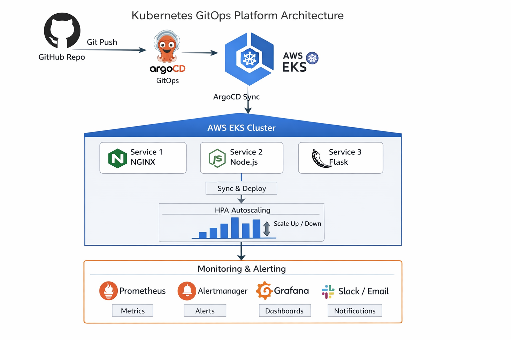
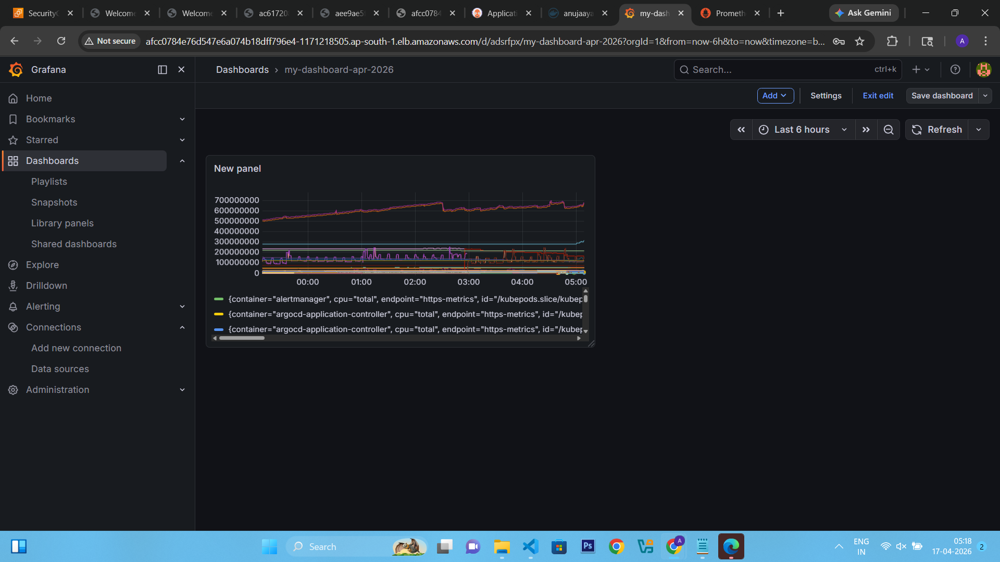
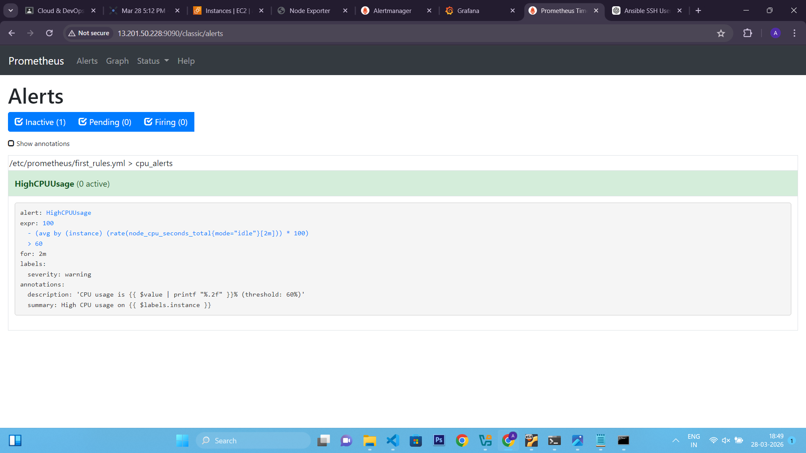
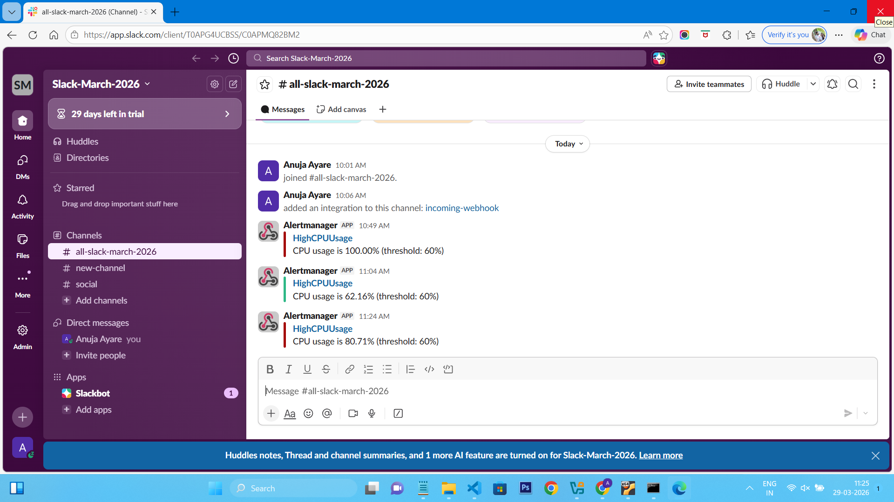
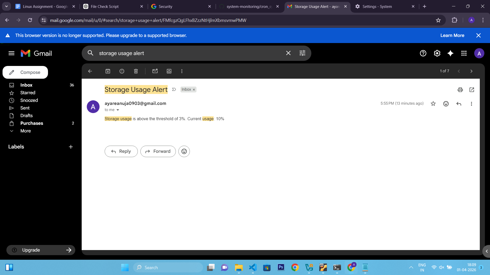

# 🚀 Kubernetes GitOps Platform (EKS + ArgoCD + Monitoring)

This repository demonstrates a complete **GitOps-based Kubernetes platform** deployed on AWS EKS using Terraform, Ansible, ArgoCD, Helm, Prometheus, and Grafana.

---

## 🏗️ Architecture

<p align="center">
  
</p>

---

## 📦 Tech Stack

* AWS EKS (Kubernetes Cluster)
* Terraform (Infrastructure provisioning)
* Ansible (Node configuration)
* ArgoCD (GitOps CD tool)
* Helm (Package management)
* Prometheus (Metrics collection)
* Grafana (Dashboards)
* Kubernetes HPA (Auto scaling)

---

## 🚀 Features

✔ GitOps deployment using ArgoCD<br/>
✔ 3 Microservices deployed<br/>
✔ LoadBalancer services (AWS ELB)<br/>
✔ Horizontal Pod Autoscaling (HPA)<br/>
✔ CPU-based scaling enabled<br/>
✔ Prometheus monitoring stack<br/>
✔ Grafana dashboards<br/>
✔ Alertmanager integration<br/>

--- 

## 📁 Project Structure

k8s-gitops-config/
│
├── helm-charts/
│   ├── service1/
│   ├── service2/
│   └── service3/
│
├── argocd-apps/
│   ├── service1.yaml
│   ├── service2.yaml
│   └── service3.yaml
│
├── monitoring/
│   ├── alert-rules.yaml
│
├── terraform/
│   ├── eks-cluster/
│
└── README.md

---

## 📌 Microservices

🔹 service1
* NGINX application
* Port: 80
* Type: LoadBalancer

---

🔹 service2
* Node.js application
* Port: 3000
* Type: LoadBalancer

---

🔹 service3
* Python Flask application
* Port: 5000
* Type: LoadBalancer

---

🌐 Access Services

 <EXTERNAL-URL> with AWS LoadBalancer URL.
1) Services (LoadBalancer)<br/>
<p align="center">
  
</p>
2) service1 
<p align="center">
  
</p>
3) service2
<p align="center">
  
</p>
4) service3
<p align="center">
  
</p>

---

## 📊 Grafana Access

<p align="center">
  
</p>

---

## 📈 Prometheus Access

<p align="center">
  
</p>

---

## ⚡ Autoscaling (HPA)

CPU-based autoscaling configured:

```bash
kubectl autoscale deployment service1 -n staging --cpu-percent=50 --min=1 --max=5
kubectl autoscale deployment service2 -n staging --cpu-percent=50 --min=1 --max=5
kubectl autoscale deployment service3 -n staging --cpu-percent=50 --min=1 --max=5
```
---

## 📊 Monitoring Stack

Installed using Helm:

helm install monitoring prometheus-community/kube-prometheus-stack -n monitoring

Includes:
* Prometheus
* Grafana
* Alertmanager
* Node Exporter
*kube-state-metrics

---

## 🚨 Alerting

Custom Prometheus alert rules included:

* High CPU usage alert<br/>
<p align="center">
  
</p><br/>

* Slack alert
  <p align="center">
  
</p><br/>

* Email alert
  <p align="center">
  
</p><br/>

---

## 🚧 Challenges & Solutions

## 1. Service Access Issues
🔧 Issue: Kubernetes services not accessible externally<br/>
✅ Fix: Corrected service type (NodePort/LoadBalancer) and updated AWS security group rules

## 2. Prometheus UI Not Accessible
🔧 Issue: Port 9090 not reachable<br/>
✅ Fix: Used port-forwarding and exposed service properly

## 3. ArgoCD Deployment Error
🔧 Issue: spec.project: Required value<br/>
✅ Fix: Added missing project field (default) in application manifest

## 4. Ansible SSH Connectivity Failure
🔧 Issue: Inventory hostname resolution failed<br/>
✅ Fix: Updated inventory with correct EC2 IPs and verified SSH keys

## 5. Terraform Resource Deletion Issue
🔧 Issue: Subnet deletion blocked<br/>
✅ Fix: Removed dependent resources (NAT gateway, route tables, ENIs) before destroy

## 6. Kubernetes Node Not Ready
🔧 Issue: Nodes initially in NotReady state<br/>
✅ Fix: Installed/verified CNI plugin and restarted kubelet

## 7. GitOps Sync Delay
🔧 Issue: Changes not reflecting in cluster<br/>
✅ Fix: Enabled auto-sync and re-synced ArgoCD applications

---

## 🎯 Final Outcome

After resolving all issues:

✔ Fully working GitOps pipeline (ArgoCD)<br/>
✔ 3 Microservices deployed successfully<br/>
✔ LoadBalancer services accessible<br/>
✔ HPA autoscaling enabled<br/>
✔ Prometheus + Grafana monitoring working<br/>
✔ Alerts system configured<br/>

---

## 🚀 Key Learning

* Debugging Kubernetes networking issues
* AWS LoadBalancer + Security Groups
* ArgoCD GitOps troubleshooting
* Metrics-server + HPA behavior
* Docker image dependency management
* Observability stack (Prometheus/Grafana)

---

