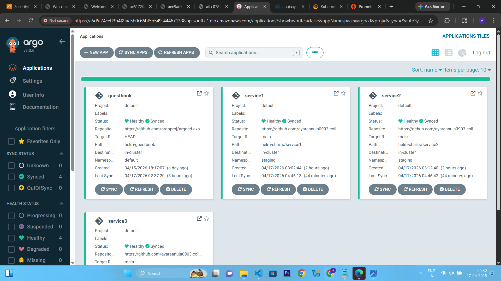
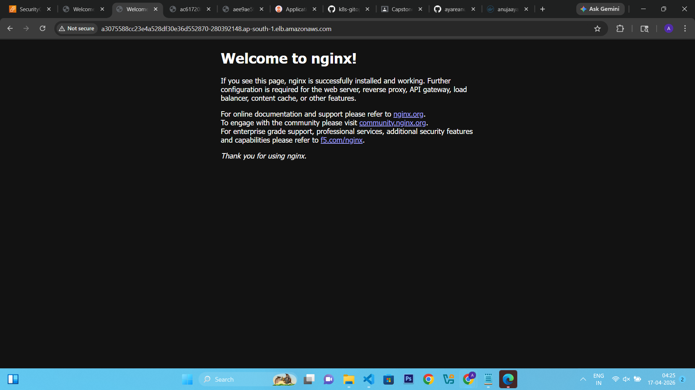
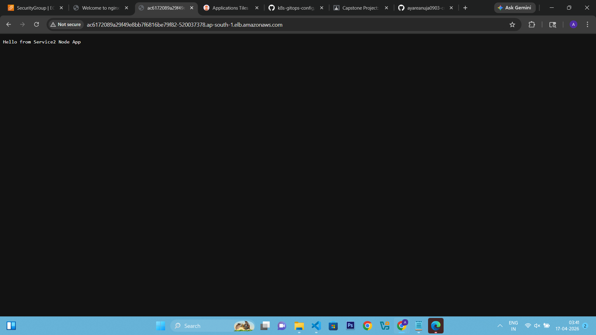
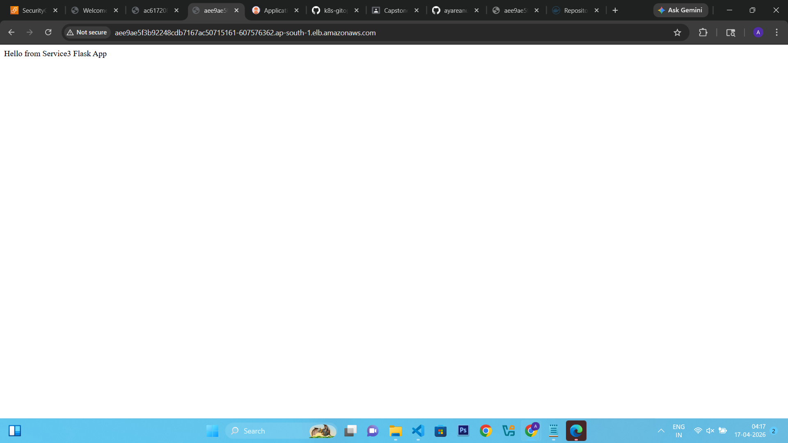

# 🚀 Kubernetes GitOps Platform (EKS + ArgoCD + Monitoring)

This repository demonstrates a complete **GitOps-based Kubernetes platform** deployed on AWS EKS using Terraform, Ansible, ArgoCD, Helm, Prometheus, and Grafana.

---

## 🏗️ Architecture

---

## 📦 Tech Stack

* AWS EKS (Kubernetes Cluster)
* Terraform (Infrastructure provisioning)
* Ansible (Node configuration)
* ArgoCD (GitOps CD tool)
* Helm (Package management)
* Prometheus (Metrics collection)
* Grafana (Dashboards)
* Kubernetes HPA (Auto scaling)

---

## 🚀 Features

✔ GitOps deployment using ArgoCD<br/>
✔ 3 Microservices deployed<br/>
✔ LoadBalancer services (AWS ELB)<br/>
✔ Horizontal Pod Autoscaling (HPA)<br/>
✔ CPU-based scaling enabled<br/>
✔ Prometheus monitoring stack<br/>
✔ Grafana dashboards<br/>
✔ Alertmanager integration<br/>

--- 

## 📁 Project Structure

k8s-gitops-config/
│
├── helm-charts/
│   ├── service1/
│   ├── service2/
│   └── service3/
│
├── argocd-apps/
│   ├── service1.yaml
│   ├── service2.yaml
│   └── service3.yaml
│
├── monitoring/
│   ├── alert-rules.yaml
│
├── terraform/
│   ├── eks-cluster/
│
└── README.md

---

## 📌 Microservices

🔹 service1
* NGINX application
* Port: 80
* Type: LoadBalancer

---

🔹 service2
* Node.js application
* Port: 3000
* Type: LoadBalancer

---

🔹 service3
* Python Flask application
* Port: 5000
* Type: LoadBalancer

---

🌐 Access Services

 <EXTERNAL-URL> with AWS LoadBalancer URL.
1) Services (LoadBalancer)<br/>
<p align="center">
  
</p>
2) service1 
<p align="center">
  
</p>
3) service2
<p align="center">
  
</p>
4) service3
<p align="center">
  
</p>

---

## 📊 Grafana Access

<p align="center">
  
</p>

---

## 📈 Prometheus Access

<p align="center">
  
</p>

---

## ⚡ Autoscaling (HPA)

CPU-based autoscaling configured:

```bash
kubectl autoscale deployment service1 -n staging --cpu-percent=50 --min=1 --max=5
kubectl autoscale deployment service2 -n staging --cpu-percent=50 --min=1 --max=5
kubectl autoscale deployment service3 -n staging --cpu-percent=50 --min=1 --max=5
```
---

## 📊 Monitoring Stack

Installed using Helm:

helm install monitoring prometheus-community/kube-prometheus-stack -n monitoring

Includes:
* Prometheus
* Grafana
* Alertmanager
* Node Exporter
*kube-state-metrics

---

## 🚨 Alerting

Custom Prometheus alert rules included:

* High CPU usage alert
* Pod restart alert

---


Open:

http://localhost:9090
📈 Features Implemented

✔ EKS Cluster via Terraform
✔ GitOps CI/CD using ArgoCD
✔ Helm-based deployments
✔ 3 Microservices deployed
✔ LoadBalancer services
✔ Horizontal Pod Autoscaler (HPA)
✔ Prometheus monitoring
✔ Grafana dashboards
✔ Alertmanager setup

🚀 Deployment Flow
GitHub Repo
   ↓
ArgoCD Sync
   ↓
Kubernetes Cluster (EKS)
   ↓
Pods + Services + HPA
   ↓
Prometheus Metrics
   ↓
Grafana Dashboards
📂 Project Structure
k8s-gitops-config/
│
├── helm-charts/
│   ├── service1/
│   ├── service2/
│   └── service3/
│
├── argocd-apps/
├── monitoring/
├── terraform/
└── README.md
